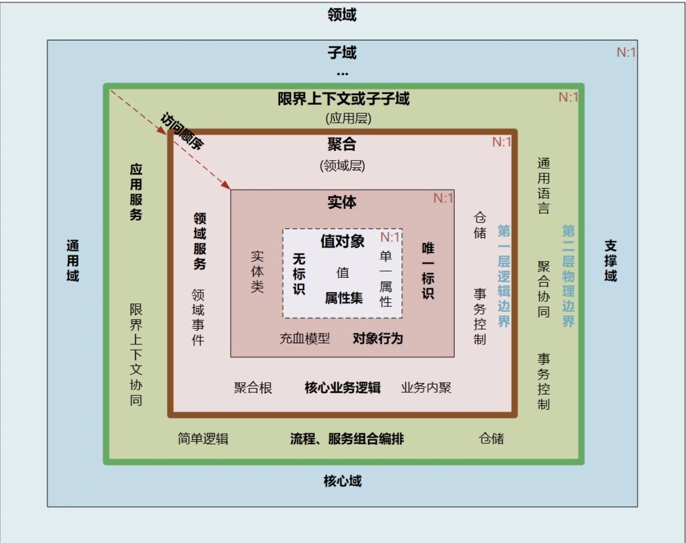

# 开篇

微服务如何拆分设计才合理，拆多小才叫微服务？
中台需要将通用的可复用的业务能力沉淀到中台业务模型，实现企业级能力复用。因此中台面临的首要问题就是中台领域模型的重构。而中台落地时，依然会面临微服务设计和拆分的问题。

## QA

### 中台和平台有什么区别与联系？

平台只是将部分通用的公共能力独立为共享平台。虽然可以通过API或者数据对外提供公共共享服务，解决系统重复建设的问题，但这类平台并没有和企业内的其它平台或应用，实现页面、业务流程和数据从前端到后端的全面融合，并且没有将核心业务服务链路作为一个整体方案考虑，各平台仍然是分离且独立的。

中台来源于平台，但中台和平台相比，它更多体现的是一种理念的转变，它主要体现在这三个关键能力上：对前台业务的快速响应能力；企业级复用能力；从前台、中台到后台的设计、研发、页面操作、流程服务和数据的无缝联通、融合能力。

中台首先体现的是一种企业级的能力，它提供的是一套企业级的整体解决方案，解决小到企业、集团，大到生态圈的能力共享、联通和融合问题，支持业务和商业模式创新。通过平台联通和数据融合为用户提供一致的体验，更敏捷地支撑前台

### 事件风暴工作坊？是指什么呢 ，如何参与进去？

事件风暴类似头脑风暴，它是项目团队与领域专家聚集在一起，快速分析和分解复杂业务领域，完成领域建模的过程。
事件风暴是一项团队活动，项目团队通过头脑风暴的形式罗列出领域中所有的领域事件，整合之后形成最终的领域事件集合，然后对于每一个事件，标注出导致该事件的命令，再为每个事件标注出命令发起方的角色，命令可以是用户发起，也可以是第三方系统调用或者定时器触发等，最后对事件进行分类，整理出实体、聚合、聚合根以及限界上下文，建立领域模型。然后你就可以基于领域模型进行微服务设计了。

### 学习ddd能够提高架构设计的能力吗？充实或者提升一下架构设计思路或者思想？
DDD是一套完整而系统的设计方法，它可以帮你建立一套从战略设计到战术设计的标准设计过程，让你的中台和微服务设计思路更加清晰，设计过程更加规范。DDD方法体系中有很多的设计思想、原则与模式，深刻理解后可以帮你提高微服务架构的设计能力。
在使用 DDD 进行微服务设计时，用到了很多解耦策略来实现领域模型和微服务设计的“高内聚，低耦合”。下面我们一起来总结一下，看看用到了哪些解耦策略？
首先来看一下微服务或聚合之间的解耦策略。
* 限界上下文实现了不同业务领域边界的微服务物理边界的解耦。
* 聚合实现了微服务内不同聚合之间逻辑边界的解耦。
* 微服务之间通过领域事件和消息中间件，以数据最终一致性的策略，实现了微服务之间的异步调用和服务解耦。
* 通过适当的数据冗余设计，如值对象的业务快照数据设计，实现了跨微服务不同聚合之间的数据解耦。
再来看一下微服务内的解耦策略。
* DDD 分层架构，通过分层和不同层的职责边界定义，实现了微服务内各层职能和代码的解耦。
* 用户接口层通过 facade 接口和数据组装适配，实现了微服务核心业务逻辑与前端应用或用户解耦。
* 仓储模式通过依赖倒置策略，实现了核心领域逻辑与基础资源处理逻辑的解耦。
* 微服务代码目录通过聚合目录和分层目录代码边界，实现了不同职能代码边界的解耦，有利于微服务架构演进时代码的组合和拆分。
* 应用服务通过对不同聚合领域服务的组合和编排，实现了同一个微服务内不同聚合的解耦。
* 聚合之间通过聚合根 ID 引用，而不是对象引用方式，完成不同聚合领域对象之间的访问，实现了聚合之间不同领域对象的解耦。
* 微服务内聚合之间通过事件总线，采用数据最终一致性策略，实现了聚合之间服务同步调用的解耦。