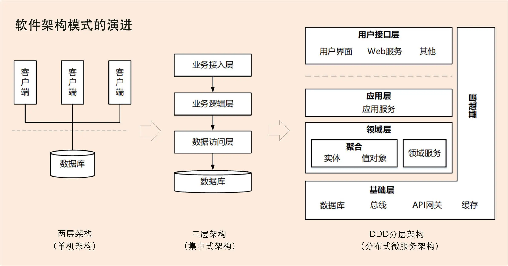

# 为何选择DDD

## 软件架构模式演进

从单机、集中式到分布式微服务架构三个阶段的演进

第一阶段是单机架构：采用面向过程的设计方法，系统包括客户端 UI 层和数据库两层，采用 C/S 架构模式，整个系统围绕数据库驱动设计和开发，并且总是从设计数据库和字段开始。

第二阶段是集中式架构：采用面向对象的设计方法，系统包括业务接入层、业务逻辑层和数据库层，采用经典的三层架构，也有部分应用采用传统的 SOA 架构。这种架构容易使系统变得臃肿，可扩展性和弹性伸缩性差。

第三阶段是分布式微服务架构：随着微服务架构理念的提出，集中式架构正向分布式微服务架构演进。微服务架构可以很好地实现应用之间的解耦，解决单体应用扩展性和弹性伸缩能力不足的问题。

在单机和集中式架构时代，系统分析、设计和开发往往是独立、分阶段割裂进行。

比如，在系统建设过程中，我们经常会看到这样的情形：A 负责提出需求，B 负责需求分析，C 负责系统设计，D 负责代码实现，这样的流程很长，经手的人也很多，很容易导致信息丢失。最后，就很容易导致需求、设计与代码实现的不一致，往往到了软件上线后，我们才发现很多功能并不是自己想要的，或者做出来的功能跟自己提出的需求偏差太大。

在单机和集中式架构这两种模式下，软件无法快速响应需求和业务的迅速变化，最终错失发展良机。此时，分布式微服务的出现就有点恰逢其时的意思了。

## 微服务拆分和设计困境

微服务拆分困境产生的根本原因就是不知道业务或者微服务的边界到底在什么地方。换句话说，需要确定业务边界和应用边界。

2004 年埃里克·埃文斯（Eric Evans）发表了《领域驱动设计》（Domain-Driven Design –Tackling Complexity in the Heart of Software）这本书，从此领域驱动设计（Domain Driven Design，简称 DDD）诞生。DDD 核心思想是通过领域驱动设计方法定义领域模型，从而确定业务和应用边界，保证业务模型与代码模型的一致性。

但 DDD 提出后在软件开发领域一直都是“雷声大，雨点小”！直到 Martin Fowler 提出微服务架构，DDD 才真正迎来了自己的时代。

有些熟悉 DDD 设计方法的软件工程师在进行微服务设计时，发现可以利用 DDD 设计方法来建立领域模型，划分领域边界，再根据这些领域边界从业务视角来划分微服务边界。而按照 DDD 方法设计出的微服务的业务和应用边界都非常合理，可以很好地实现微服务内部和外部的“高内聚、低耦合”。于是越来越多的人开始把 DDD 作为微服务设计的指导思想。

现在，很多大型互联网企业已经将 DDD 设计方法作为微服务的主流设计方法了。DDD 也从过去“雷声大，雨点小”，开始真正火爆起来。

## 为什么 DDD 适合微服务？

DDD 是一种处理高度复杂领域的设计思想，它试图分离技术实现的复杂性，并围绕业务概念构建领域模型来控制业务的复杂性，以解决软件难以理解，难以演进的问题。DDD 不是架构，而是一种架构设计方法论，它通过边界划分将复杂业务领域简单化，帮我们设计出清晰的领域和应用边界，可以很容易地实现架构演进。

DDD 包括战略设计和战术设计两部分。

战略设计主要从业务视角出发，建立业务领域模型，划分领域边界，建立通用语言的限界上下文，限界上下文可以作为微服务设计的参考边界。

战术设计则从技术视角出发，侧重于领域模型的技术实现，完成软件开发和落地，包括：聚合根、实体、值对象、领域服务、应用服务和资源库等代码逻辑的设计和实现。

DDD 战略设计会建立领域模型，领域模型可以用于指导微服务的设计和拆分。事件风暴是建立领域模型的主要方法，它是一个从发散到收敛的过程。它通常采用用例分析、场景分析和用户旅程分析，尽可能全面不遗漏地分解业务领域，并梳理领域对象之间的关系，这是一个发散的过程。事件风暴过程会产生很多的实体、命令、事件等领域对象，我们将这些领域对象从不同的维度进行聚类，形成如聚合、限界上下文等边界，建立领域模型，这就是一个收敛的过程。

我们可以用三步来划定领域模型和微服务的边界。
第一步：在事件风暴中梳理业务过程中的用户操作、事件以及外部依赖关系等，根据这些要素梳理出领域实体等领域对象。

第二步：根据领域实体之间的业务关联性，将业务紧密相关的实体进行组合形成聚合，同时确定聚合中的聚合根、值对象和实体。在这个图里，聚合之间的边界是第一层边界，它们在同一个微服务实例中运行，这个边界是逻辑边界，所以用虚线表示。

第三步：根据业务及语义边界等因素，将一个或者多个聚合划定在一个限界上下文内，形成领域模型。在这个图里，限界上下文之间的边界是第二层边界，这一层边界可能就是未来微服务的边界，不同限界上下文内的领域逻辑被隔离在不同的微服务实例中运行，物理上相互隔离，所以是物理边界，边界之间用实线来表示。

在战略设计中我们建立了领域模型，划定了业务领域的边界，建立了通用语言和限界上下文，确定了领域模型中各个领域对象的关系。到这儿，业务端领域模型的设计工作基本就完成了，这个过程同时也基本确定了应用端的微服务边界。

在从业务模型向微服务落地的过程中，也就是从战略设计向战术设计的实施过程中，我们会将领域模型中的领域对象与代码模型中的代码对象建立映射关系，将业务架构和系统架构进行绑定。当我们去响应业务变化调整业务架构和领域模型时，系统架构也会同时发生调整，并同步建立新的映射关系。

## DDD与微服务关系

DDD 是一种架构设计方法，微服务是一种架构风格，两者从本质上都是为了追求高响应力，而从业务视角去分离应用系统建设复杂度的手段。两者都强调从业务出发，其核心要义是强调根据业务发展，合理划分领域边界，持续调整现有架构，优化现有代码，以保持架构和代码的生命力，也就是我们常说的演进式架构。

DDD 主要关注：从业务领域视角划分领域边界，构建通用语言进行高效沟通，通过业务抽象，建立领域模型，维持业务和代码的逻辑一致性。

微服务主要关注：运行时的进程间通信、容错和故障隔离，实现去中心化数据管理和去中心化服务治理，关注微服务的独立开发、测试、构建和部署。

DDD 不仅可以用于微服务设计，还可以很好地应用于企业中台的设计。如果你的企业正在做中台转型，DDD 将会是一把利器，它可以帮你建立一个非常好的企业级中台业务模型.

## DDD带来以下收获

1. DDD 是一套完整而系统的设计方法，它能带给你从战略设计到战术设计的标准设计过程，使得你的设计思路能够更加清晰，设计过程更加规范。
2. DDD 善于处理与领域相关的拥有高复杂度业务的产品开发，通过它可以建立一个核心而稳定的领域模型，有利于领域知识的传递与传承。
3. DDD 强调团队与领域专家的合作，能够帮助你的团队建立一个沟通良好的氛围，构建一致的架构体系。
4. DDD 的设计思想、原则与模式有助于提高你的架构设计能力。
5. 无论是在新项目中设计微服务，还是将系统从单体架构演进到微服务，都可以遵循 DDD 的架构原则。
6. DDD 不仅适用于微服务，也适用于传统的单体应用。